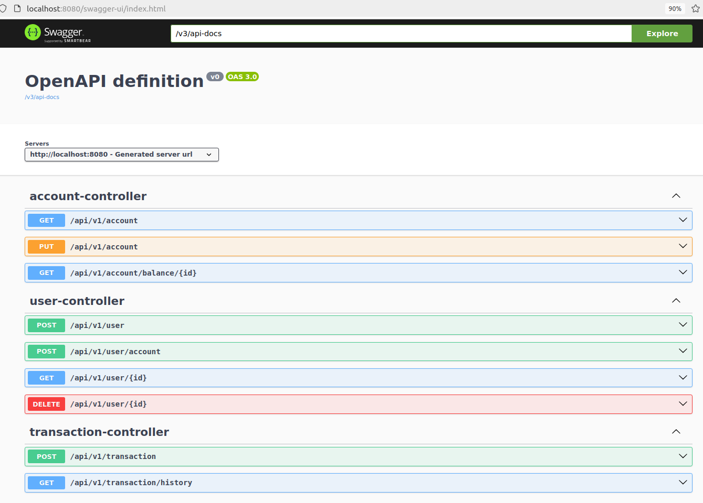

Tiny Bank application
===============

Launch the project (Java 21):

`mvn clean install`

`docker build -t tiny-bank .`

`docker run -p 8080:8080 tiny-bank`

Visit Swagger UI page to get familiar with the API

http://localhost:8080/swagger-ui/index.html

Test task limitations
---------------
Accounts have no currency.
Account balance is stored in a minimal calculation unit, e.g cents.

JPA limitation
---------------
Since there is no real JPA some limitation are applied
* `@Transactional` commented
* To bind entities between each other id is used not entity field

Application rules
---------------
**User**

User status model:
* ACTIVE
* DEACTIVATED

To create user pass name and surname in UserDto. Account for the user will be created automatically.

To deactivate pass the user id to the User endpoint. All user accounts will be automatically closed.

Addional accounts for user can be created using the User endpoint.

**Account**

Account status model:
* ACTIVE
* FROZEN
* CLOSED

Account is created in active status. Status can be changed by changeStatus() endpoint. 
To perform operations with account it must be active. 
If account closed or frozen getBalance() operation will return error. 
If balance is less than credit transaction amount operation will fail.

**Transaction**

Deposit/withdraw and transfer can be implemented by using transaction endpoint.
To perform any transaction amount must be specified. Amount must not be negative.
To deposit specify Account id in deposit field.
To withdraw specify Account id in credit field.
To transfer from Account A to account B specify accont A id in credit field and account B id in deposit field.

**Success path**

1. Create user

   `POST http://localhost:8080/api/v1/user`

   `{"name":"Barby", "surname":"Pink"}`
    

2. Retrieve user accounts

`GET http://localhost:8080/api/v1/account?userId={userId}`

3. Deposit money to the account

`POST http://localhost:8080/api/v1/transaction`

`{
   "deposit":"{accountId}",
   "amount":"200"
   }`

4. Withdraw money from the account

`POST http://localhost:8080/api/v1/transaction`

`{
"credit":"{accountId}",
"amount":"50"
}`

5. Check a balance

`GET http://localhost:8080/api/v1/account/balance/{accountId}`

6. Create a second user

   `POST http://localhost:8080/api/v1/user`

   `{"name":"Test", "surname":"Junior"}`

7. Retrieve the second user accounts

`GET http://localhost:8080/api/v1/account?userId={userId2}`

8. Transfer money from the first user to the second user
`POST http://localhost:8080/api/v1/transaction`

`{
"deposit":"{accountId2}",
"credit":"{accountId}",
"amount":"50"
}`

9. Check balance of the second user account

`GET http://localhost:8080/api/v1/account/balance/{accountId2}`

10. View history for the first user account

`GET http://localhost:8080/api/v1/transaction/history?accountId={accountId}`